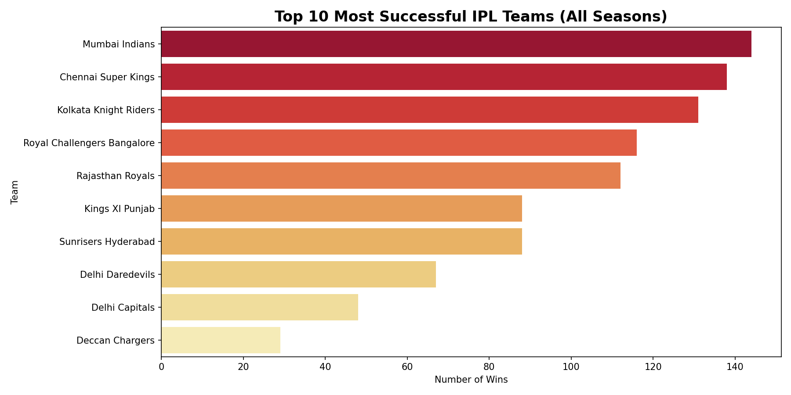
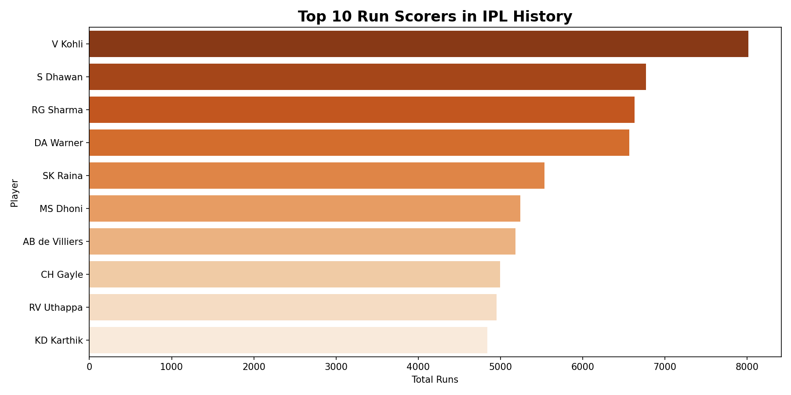
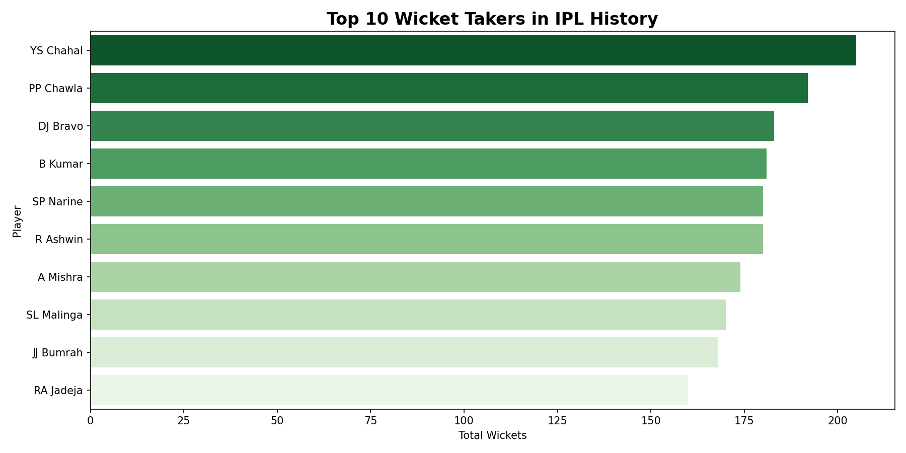
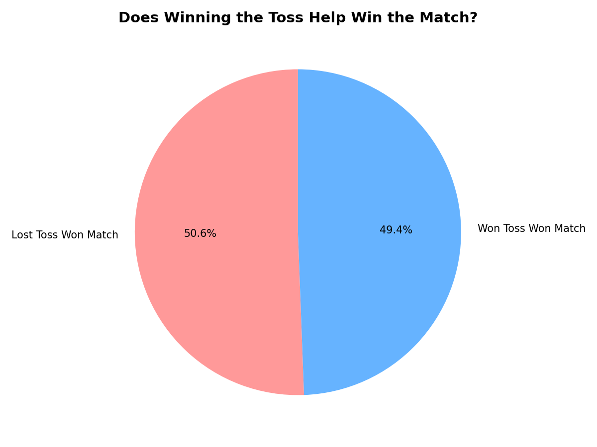
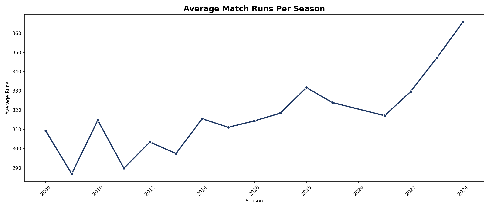

# 🏏 IPL Analytics Dashboard

An end-to-end data analysis project exploring 17 seasons of IPL data (2008–2024) using Python, Pandas, Matplotlib and Seaborn.

## 📊 Analysis Covered

- 🏆 Most successful teams across all seasons
- 🎯 Impact of toss on match results
- ⭐ Top Player of the Match winners
- 📈 Average runs scored per season over the years
- 🏏 Top 10 run scorers in IPL history
- 🎳 Top 10 wicket takers in IPL history

## 🛠️ Tech Stack

- **Python** — Pandas, NumPy, Matplotlib, Seaborn
- **Jupyter Notebook** — Analysis and visualisation
- **Dataset** — IPL Complete Dataset 2008–2024 (Kaggle)

## 📁 Project Structure
```
ipl-analytics-dashboard/
├── data/                  # Dataset and saved plots
├── ipl_analysis.ipynb     # Main analysis notebook
├── requirements.txt       # Dependencies
└── README.md
```

## 🚀 How to Run

1. Clone the repo
```bash
git clone https://github.com/hitishanathwani/ipl-analytics-dashboard.git
cd ipl-analytics-dashboard
```
2. Install dependencies
```bash
pip install -r requirements.txt
```
3. Launch Jupyter
```bash
jupyter notebook
```
4. Open `ipl_analysis.ipynb` and run all cells

## 📸 Visualisations

### Most Successful Teams


### Top Run Scorers


### Top Wicket Takers


### Toss Impact on Results


### Average Runs Per Season


## 👩‍💻 Author
**Hitisha Nathwani**
[LinkedIn](https://linkedin.com/in/hitishanathwani) • [GitHub](https://github.com/hitishanathwani)